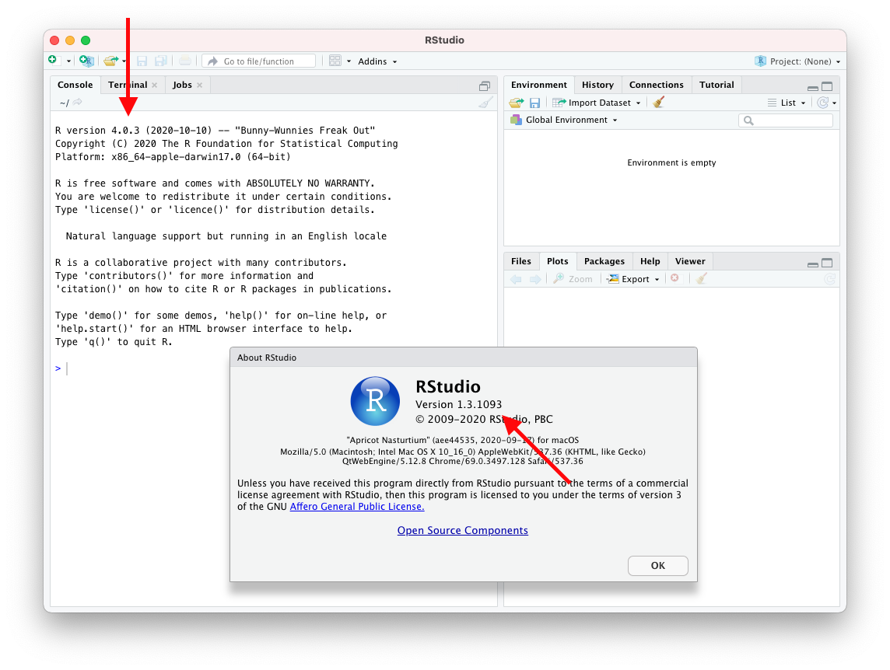

```{r set-options, echo=FALSE, cache=FALSE}
options(width=100)
library(knitr)
opts_chunk$set(comment=NA)
```

# Exercise 1
The R console automatically displays the R version (along with other messages). To determine the RStudio version, open "Help" &ndash; "About RStudio".

```{r, fig.retina = NULL, echo=FALSE}

```

# Exercise 2
This exercise demonstrates that computers do not represent floating point exactly. In this example, the error is quite apparent (because `4 %/% 0.4` should be 10 with zero remainder).
```{r}
4 / 0.4
4 %/% 0.4
4 %% 0.4
```

# Exercise 3
```{r}
(11 + 27 + 15 + 10 + 33 + 18 + 25 + 22 + 39 + 11) / 10
```

# Exercise 4
```{r}
((5**5 - pi) * 19/3) / (sqrt(13) + 7**(2/3))
```

---
[](http://creativecommons.org/licenses/by-nc-sa/4.0/)