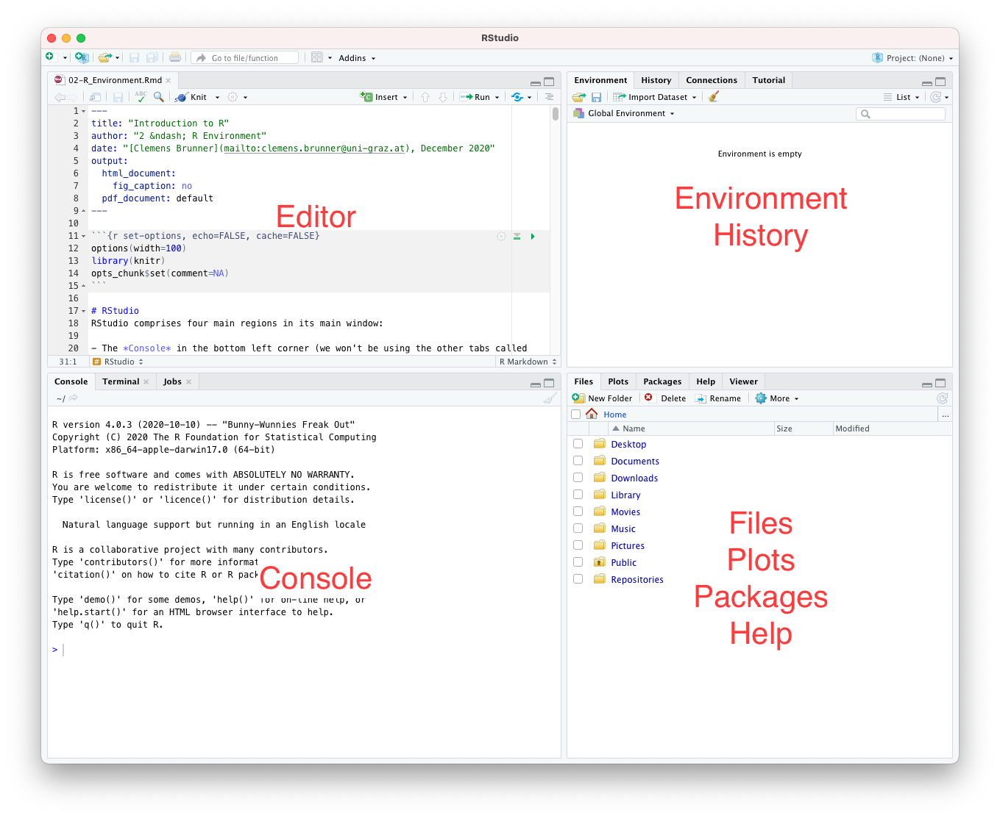
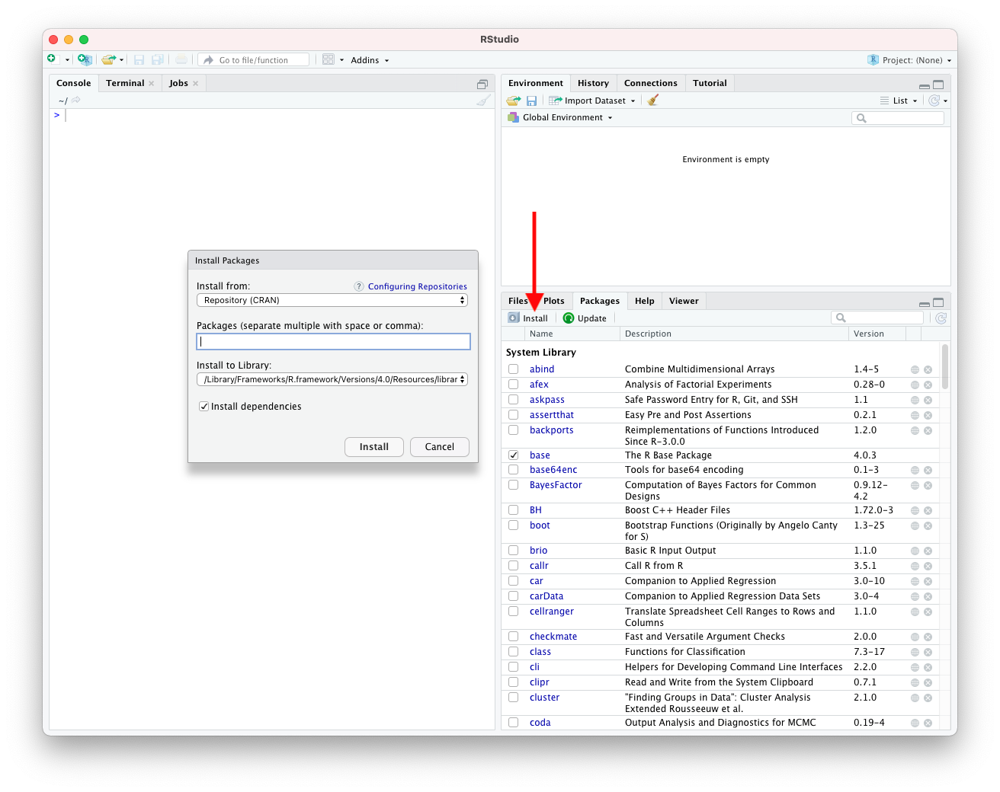
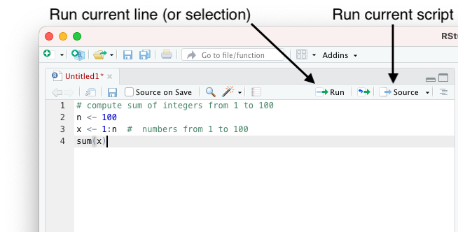
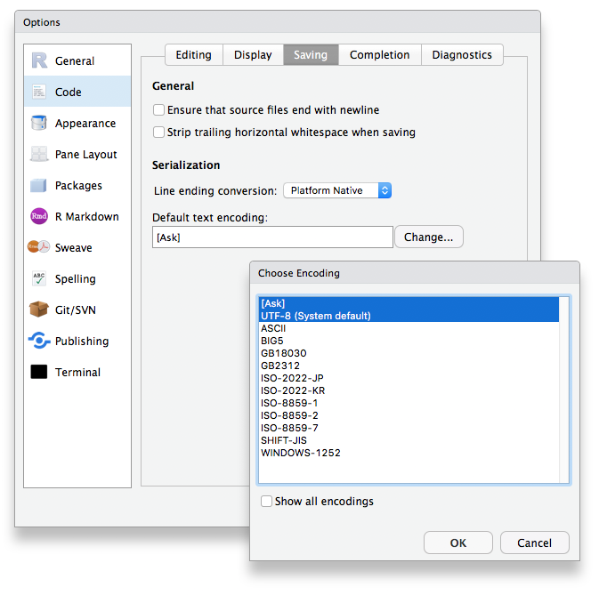

```{r set-options, echo=FALSE, cache=FALSE}
options(width=100)
library(knitr)
opts_chunk$set(comment=NA)
```

# RStudio
RStudio comprises four main regions in its main window:

- The *Console* in the bottom left corner (we won't be using the other tabs called *Terminal*, *R Markdown*, and *Jobs*).
- The *Editor* in the top left corner (only if you have opened one or more files).
- The *Environment* and *History* in the top right corner (we won't be using the *Connections*  and *Tutorial*  tabs).
- The *Files*, *Plots*, *Packages*, and *Help*  tabs in the lower right corner (we won't be using the *Viewer* tab).

```{r, echo=FALSE}

```

We have already used the R console &ndash; that's where R is lurking in the background waiting for our commands. We will soon see that we can collect and store R commands in a so-called R script (a text file). That's when we need the editor part in RStudio. We will also talk about the other components &ndash; let's start with package management (make sure to switch to the *Packages*  tab in the lower right).

# Packages
Packages extend the functionality of R, which ships only with a basic set of core features. As soon as you need to do something that is not included in base R, you will need to install a suitable third-party package. Fortunately, this process is pretty straightforward. Almost all additional packages are available in the [Comprehensive R Archive Network (CRAN)](https://cran.r-project.org/web/packages/). Exactly two steps are required to use a third-party package:

1. Install the package (just once)
2. Activate the package (before you can use it in the current R session)

Before we discuss each step in detail, let's step back a bit. Sometimes it can be a challenge to find the right package to install. After all, if you don't know the package name, you cannot install it. Usually, a Google search eventually leads to the right package (for example, if you are looking for a package that provides linear mixed models, the search query "R linear mixed models" contains the `lme4` package among the first results, which is probably the most popular R package for these specific models). In addition, the [CRAN Task Views](https://cran.r-project.org/web/views/) provide a nice overview of a broad range of topics with relevant R packages. For example, if you are in social sciences and you want to know which packages might be relevant in this field, the [Social Sciences Task View](https://cran.r-project.org/web/views/SocialSciences.html) contains a brief description of this topic.

Let's now learn how to install an R package given that we know its name. Then we will learn how to activate a package in the current R session.

## Package management in RStudio
RStudio lists all installed packages in the *Packages* tab in the lower right region of the window. Each row contains the name, a short description, and the version of a package. In addition, there are also icons/links that let you browse the package website as well as uninstall the package if you don't need it anymore.

Clicking on "Install" pops up a dialog window which lets you install a package from CRAN &ndash; all you need to do is enter the package name. Similarly, clicking on "Update" lets you update one or more (or even all) installed packages. It is generally a good idea to keep your packages up to date, so make sure to check for updates regularly.

In case you want to get rid of an installed package, you can click on the tiny gray "X" icon in the rightmost column of a package.

```{r, fig.retina = NULL, echo=FALSE}

```

The checkboxes to the left of each package indicate if a package is activated or not. Some core packages (such as `base` or `datasets`) are activated by default, but most additional packages are inactive. To activate or deactivate a package, simply click on the corresponding checkbox.

To re-iterate: you only have to install a package once, but every time you want to use functions contained in a specific package, you need to activate that package before using it.

## Package management with R commands
Under the hood, RStudio uses R commands to perform package management tasks. Therefore, you can install and activate packages directly from the console.

Here's how to get a list of all installed packages (this list corresponds to the list in the *Packages* tab in RStudio):

```{r}
library()
```

Similarly, the following command lists all activated packages:

```{r}
search()
```

If you want to install a new package (e.g. `psych`), you can type:

```{r eval=FALSE}
install.packages("psych")
```

Note that the package name must be enclosed in quotes.

Finally, here's the most important command that you will use over and over in your own scripts. Activating a package (e.g. `psych`) is as simple as typing in the following command:

```{r}
library(psych)
```

In this case, the package name does not have to be in quotes.

## Essential packages
We will use a couple of R packages in this course. If you want, you can go ahead and install them right now. That way, you will be able to simply activate them when needed.

- `readr`
- `tidyr`
- `ggplot2`
- `psych`
- `car`

I specifically recommend packages from the [Tidyverse](https://www.tidyverse.org/). Packages that are part of this Tidyverse follow a common philosophy of "tidy data", which makes it very convenient to perform data analysis in a consistent way. From the list of packages used in this course, `readr`, `tidyr`, and `ggplot2` are Tidyverse packages. If you decide to use R for your own projects, I encourage you to check out other Tidyverse packages (such as `dplyr`) after you have mastered the basics of R (covered in this course).

# The R programming language
## Scripts
Running R commands in the console is very convenient for exploring data and trying out different things interactively. This process is called the [REPL](https://en.wikipedia.org/wiki/Read%E2%80%93eval%E2%80%93print_loop), because the console **r**eads a command, **e**valuates it, and **p**rints the result &ndash; these steps repeat in a **l**oop over and over again.

However, such interactive data exploration eventually leads to a series of commands that need to be stored permanently &ndash; that's where scripts come in handy. An R script is a simple plaintext file (with file extension `.R`) consisting of R commands. Usually, each line of the script contains exactly one command. RStudio can load, edit, save, and run R scripts with its built-in editor.

A script implements a reproducible analysis pipeline. This means that you can exactly reproduce all results when running the whole script (from top to bottom, line by line) in a pristine R session. Therefore, reproducing an analysis entails loading a script and running all lines sequentially &ndash; the "Source" button (or the related "Source with echo" button) does exactly that.

In addition, you might also want to run only certain lines of the script to execute or repeat only parts of an analysis. Clicking on the "Run" button runs the current line or all selected lines.

```{r, fig.retina = NULL, echo=FALSE}

```

If a script uses functions from packages, it is necessary to activate all corresponding packages (ideally at the very beginning of the script). Remember that `library(package)` activates a package (named `package` in this example).

However, do *not* include `install.packages("package")` in your script, because you do not want to install the package every time you run the script!

One final note for Windows users: make sure to select UTF-8 as the default encoding for scripts (macOS and Linux already use this encoding by default). Open the RStudio preferences, navigate to "Code" &ndash; "Saving", and select UTF-8 in the field "Default text encoding" (by clicking on "Change..."):

```{r, fig.retina = NULL, echo=FALSE}

```

## Working directory
An R session operates and works in a specific directory on your computer &ndash; the so-called working directory. The following command prints the current working directory:

```{r, eval=FALSE}
getwd()
```

RStudio also shows the current working directory right below the console title (usually, this is `~/` initially, which is a short name for your home directory). The contents of the working directory (i.e. files and subdirectories) is shown in the *Files* tab in the lower right part of RStudio. Alternatively, the `dir()` command also lists the working directory contents.

The working directory enables R to load data by specifying only the file name (instead of the full path). Therefore, it is good practice to put scripts and data files into a common directory tree and set the working directory to point to this location before running the script.

The command `setwd("path/to/working/directory")` sets the working directory to the path specified in quotes (in this example, the new working directory would be `path/to/working/directory`)[^1]. Instead of `setwd`, RStudio offers two graphical options to set the working directory:

[^1]: Note that paths should always use slashes `/` as separators, even on Windows (which normally uses backslashes `\`).

1. "Session" &ndash; "Set Working Directory" (any of the three options works).
2. Navigate to the desired directory in the *Files* pane and click on "More" &ndash; "Set As Working Directory".

In summary, it is important to set the working directory to the desired location before sourcing an R script. Importantly, do not include any `setwd` commands in your script, because this prevents other people from running the script (mainly because in general they will not have the same directories on their computers that you have).

## Workspace or environment
All manually created objects such as data and variables (more on that later) in the current R session are called *workspace* or *environment*. The following command lists all objects in the current environment:

```{r}
ls()
```

RStudio has a dedicated *Environment* pane (top right) that makes it easy to constantly monitor the workspace.

## Syntax
Let's take a closer look at the following example script:

```{r results=FALSE}
# compute sum of integers from 1 to 100
n <- 100
x <- 1:n
sum(x)
n * (n + 1) / 2  # closed-form solution for sum(x)
```

This example demonstrates the basic R syntax (language rules).

First of all, there is typically one command per line (although that isn't strictly necessary, but it is strongly recommended because it increases code readability).

Next, R ignores everything after a `#` character (until the end of the line). This is how we write comments that explain the code. Do not underestimate the importance of comments &ndash; they exist to help you (or other people) understand the code long after you've written it. If nothing else, write comments for your future self &ndash; you will thank yourself later! Note that good comments explain the why and not the how (the latter should be clear by reading the code).

### Variables
We can assign values to variables with the assignment operator `<-`, for example `n <- 100` assigns the value `100` to the variable `n`. A variable is a name (an alias, a placeholder) for a value, similar to variables in mathematics. Once a variable is defined (assigned), it appears in the environment. We can inspect the contents of a variable by simply typing its name in the console:

```{r}
n
```

Note that in contrast to most programming languages, you should not use `=` for assignments although it technically works most of the time (but it's complicated, so for now just remember to always use `<-`).

Variable names are case-sensitive (so `n` is different from `N`). Names can contain letters, digits, underscores, and dots (which most people try to avoid if possible).

### Functions
Informally, a function is a "mini" script that we can run by calling the function. In our example, we call the function `sum` as follows:

```{r}
sum(x)
```

A function call consists of the function name and a pair of parentheses `()`. Inside the parentheses we can provide arguments &ndash; additional information that the functions needs to work properly. In this case, we pass exactly one argument (the variable `x`, which contains a bunch of numbers that the function sums up). Note that even if you do not supply any arguments, you still need to include the parentheses. Functions that work without arguments include `getwd()`, `library()`, and `ls()`. Some functions also take multiple arguments, for example the function call `sum(1, 2, 3)` has three arguments (separated by commas).

Importantly, functions can also return a value (the result). For instance, calling `sum(1, 2, 3)` returns the value `6` as its result.

Almost all R commands are expressions involving function calls, variables, and operators, so it is very helpful to remember these basic building blocks.

## Documentation
R comes with extensive integrated documentation (which is available offline). RStudio displays help pages in the *Help* panel (lower right). There are two options to get help for a specific R command directly in the R console (the following example demonstrates this for the `sum` function):  

```{r}
help(sum)
?sum
```

### Example
Let's inspect the help text for the `sum` function more closely, because all help pages are organized in a similar way. It is a good habit to quickly skim the help text for a new command that you are about to use for the first time &ndash; this will get you started much quicker than just assuming things (that might not be true) or filling in arguments by trial and error.

#### Header
The very first line contains the name of the function and the package it comes from in curly braces:

    sum {base}

We now know that the `sum` function is contained in the `base` package.

#### Title
Next, the title summarizes the purpose of the function:

    Sum of Vector Elements
    
#### Description
This section contains a slightly more elaborate summary of what the function is all about.

#### Usage
This section describes how to call the function:

    sum(..., ra.rm = FALSE)

Alright, we already know that we have to write the function name followed by a pair of parentheses. The usage also tells us which arguments we can pass &ndash; in this case, there are two possible arguments (`...` and `na.rm`). The second argument `na.rm` has a default value of `FALSE`, which means that if we do not pass a second argument in our function call, `na.rm` automatically gets its default value of `FALSE`.

#### Arguments
More details on each argument are listed in the subsequent section "Arguments". In this example, we learn that `...` should be "numeric or complex or logical vectors" (we'll learn about vectors soon).

#### Details
This sections contains a very detailed description of the function. If you want to understand what is going on when you call the function, you need to read this.

#### Value
This section tells us what the function returns.

#### References
Often the help text includes some useful references such as books or articles.

#### See Also
This section lists similar and related functions.

#### Examples
Last but definitely not least, most help pages contain several usage examples. You can copy and paste them into the console to try them out and see the function in action.

```{r}
sum(1:5)
sum(1, 2, 3, 4, 5)
sum(1:2, 3:5)
sum(1:5, NA)
sum(1:5, NA, na.rm = TRUE)
```

### Another example
Let's take a look at another help page, this time we'll view the documentation of `mean`:

```{r}
?mean
```

We learn that this function computes the arithmetic mean, and we can use it like this:

    mean(x, trim = 0, na.rm = FALSE, ...)

The first argument `x` is a (numeric) vector consisting of numbers of which we want to compute the arithmetic mean. The next two arguments (`trim` and `na.rm`) both have default values, so we don't need to specify values if we are happy with the defaults. The fourth argument `...` summarizes "further arguments" that are not really explained.

Let's try some examples to see the different ways we can call the `mean` function. Let's assume we have a numeric vector (a collection of numbers) stored in the variable `numbers`:

```{r}
numbers <- c(1, 8, 17, -6, 5.5, -12.2)
```

We can compute the arithmetic mean like this:

```{r}
mean(numbers)
```

Optionally, we can name arguments in our function call. The first argument is called `x`, so we could write:

```{r}
mean(x=numbers)
```

The same is true for the other arguments; we can either pass values by position or by name if we want to override their default values:

```{r}
mean(numbers, trim=0.25)
mean(numbers, 0.25)
mean(x=numbers, trim=0.25)
mean(x=numbers, 0.25)
```

# Literature
## Books
- [Discovering Statistics Using R](https://uk.sagepub.com/en-gb/eur/discovering-statistics-using-r/book236067)
- [OpenIntro Statistics](https://www.openintro.org/stat/textbook.php?stat_book=os)
- [Learning Statistics With R](http://compcogscisydney.org/learning-statistics-with-r/)

## Tutorials and documentation
- [learnr](https://rstudio.github.io/learnr/) (available in the *Tutorial*  pane in the top right area of RStudio)
- [An Introduction to R](https://cran.r-project.org/doc/manuals/r-release/R-intro.html)
- [Quick-R](http://www.statmethods.net/)
- [R Documentation](http://www.rdocumentation.org/)
- [Rtips](http://pj.freefaculty.org/R/Rtips.html)
- [Cookbook for R](http://www.cookbook-r.com/)

## Online courses
- [Introduction to R for Data Science](https://www.edx.org/course/introduction-r-data-science-3)
- [R Programming](https://www.coursera.org/learn/r-programming)
- [Master Statistics with R](https://www.coursera.org/specializations/statistics)
- [Mastering Software Development in R](https://www.coursera.org/specializations/r)

# Exercises
## Exercise 1
Install the packages `readr`, `Hmisc`, and `psych` &ndash; try using both the RStudio GUI and R commands! Determine the versions of these three packages. How can you uninstall/remove a package?

## Exercise 2
Show the help page for the `help` command (two options)!

## Exercise 3
Create a script called `my_first_script.R`. Add the following elements to your script:

- A comment containing the text "Exercise 3"
- Activate the package `psych`
- Compute the mean of the numbers 45, 66, 37, 54, 17, and 22. Assign the result to the variable `m` &ndash; use only basic arithmetic operations (and not the function `mean`)!

Feel free to insert empty lines to make your script easy to read!

## Exercise 4
Let's assume we want to calculate the arithmetic mean of the numbers 1, 2, and 3. Having already learned about the `mean` function, we want to put our knowledge to use, so we call the function as follows:

```{r}
mean(1, 2, 3)
```

What's wrong with the function call (the arithmetic mean should be 2)? *Hint:* Read the "Usage" and "Arguments" section of the help page carefully!

---
[](http://creativecommons.org/licenses/by-nc-sa/4.0/)