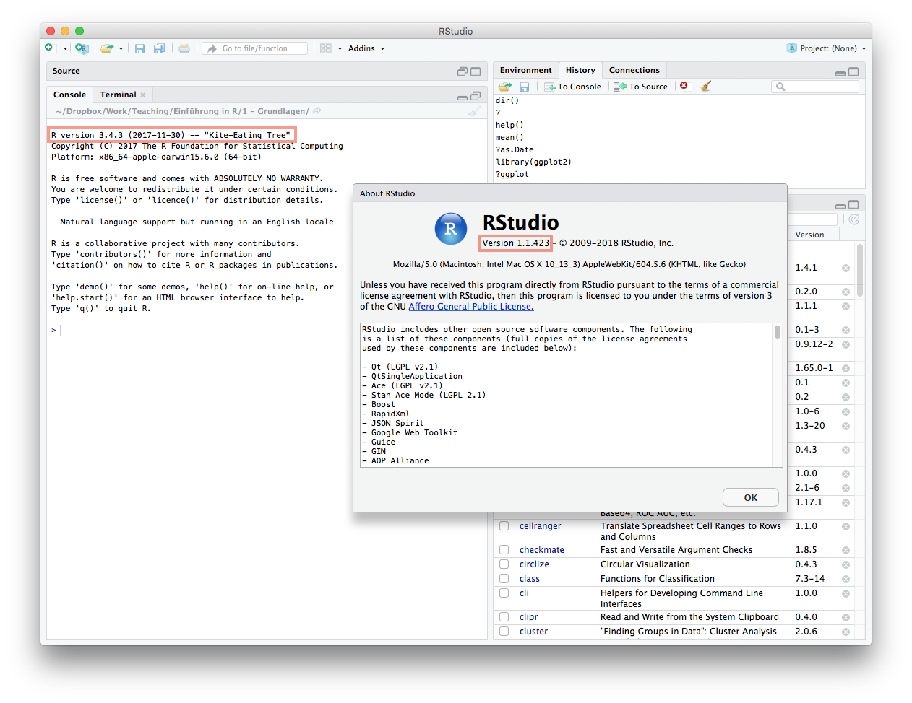

```{r set-options, echo=FALSE, cache=FALSE}
options(width=100)
library(knitr)
opts_chunk$set(comment=NA)
```

# Grundlagen

## Übungen
### Übung 1
Nach der Installation von R und RStudio startet man RStudio, und die verwendete R-Version wird in der Console angezeigt. Die Versionsnummer von RStudio erfährt man, wenn man "About RStudio" im Menü "Help" aufruft.

```{r, fig.retina = NULL, echo=FALSE}

```

### Übung 2
```{r}
619 / 65
619 %/% 65
619 %% 65
```


### Übung 3
```{r}
(11 + 27 + 15 + 10 + 32 + 18 + 25 + 22 + 29 + 11) / 10
```

### Übung 4
```{r}
sqrt(2) * ((5**3 - 2) * sqrt(18)) / ((7/5 + 13.2) * 7**(2/3))
```

---

```{r, fig.retina = NULL, echo=FALSE}
knitr::include_graphics("cc_license.png")
```

Diese Unterlagen sind lizenziert unter einer [Creative Commons Namensnennung - Nicht-kommerziell - Weitergabe unter gleichen Bedingungen 4.0 International Lizenz](http://creativecommons.org/licenses/by-nc-sa/4.0/).