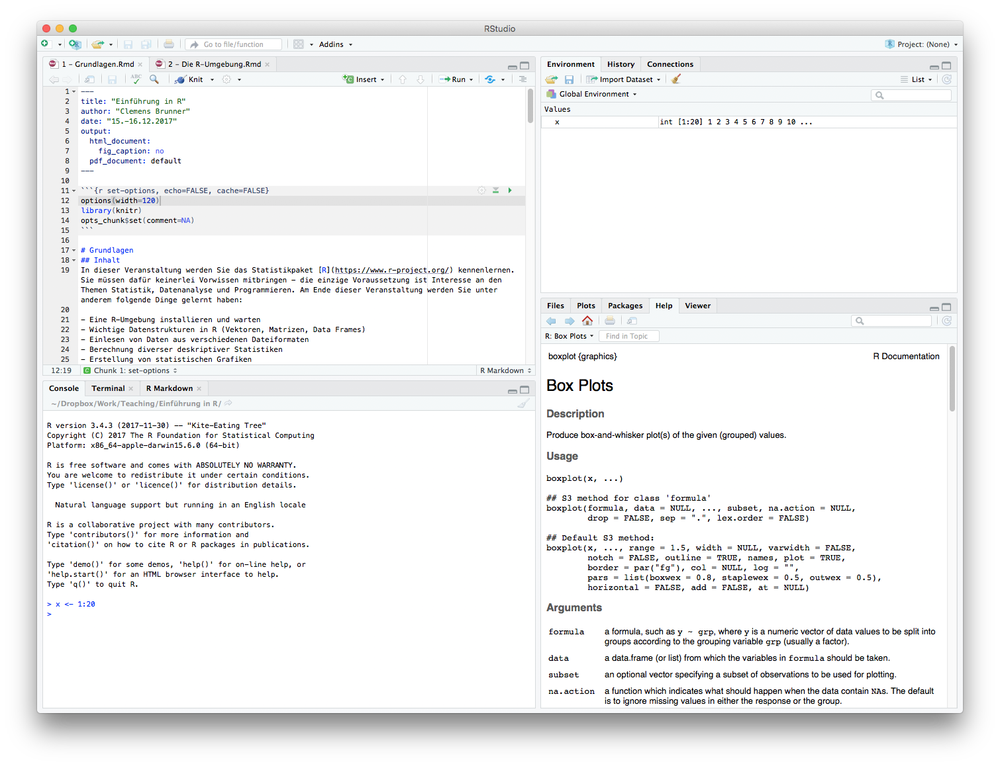

```{r set-options, echo=FALSE, cache=FALSE}
options(width=110)
library(knitr)
opts_chunk$set(comment=NA)
```

# Die R-Umgebung
## RStudio
Das Programmfenster von RStudio ist in der Standardeinstellung in vier Bereiche unterteilt. Links unten befindet sich die *Console* (die Tabs *Terminal* sowie *R Markdown* sind für uns momentan nicht relevant). Links oben befindet sich der Editor (falls eine Datei geöffnet ist; es können auch mehrere Dateien gleichzeitig geöffnet sein). Rechts oben gibt es eine Übersicht aller geladenen Objekte (*Environment*) und eine Liste aller jemals eingegebenen Befehle (*History*) (*Connections* ist für uns hier nicht von Bedeutung). Rechts unten werden wahlweise Dateien im aktuellen Verzeichnis (*Files*), grafische Ausgaben (*Plots*), eine Paketverwaltung (*Packages*) oder ein Hilfefenster (*Help*) angezeigt (*Viewer* ist für uns nicht relevant).

```{r, fig.retina = NULL, echo=FALSE}

```

## Pakete
Pakete erweitern den Funktionsumfang von R. Von Haus aus wird R nur mit einer Handvoll an Paketen ausgeliefert - sobald man damit nicht mehr auskommt, kann man sehr einfach zusätzliche Pakete hinzufügen. Diese Zusatzpakete sind alle im [Comprehensive R Archive Network (CRAN)](https://cran.r-project.org/web/packages/) gesammelt verfügbar. Wenn ein zusätzliches Paket einmal installiert ist, kann es danach jederzeit aktiviert und verwendet werden. Das bedeutet also, dass folgende zwei voneinander abhängige Schritte auszuführen sind:

1. Installieren eines neuen Pakets (nur ein Mal)
1. Aktivieren eines installierten Pakets (vor jeder Verwendung)

Im CRAN gibt es tausende Pakete, und deswegen kann es mitunter schwierig sein, ein passendes bzw. das gesuchte Paket zu finden. Eine sehr praktische Übersicht gibt es auf [CRAN Task Views](https://cran.r-project.org/web/views/). Hier werden Pakete nach Anwendungsgebieten gruppiert dargestellt.

Zur Paketverwaltung gibt es zwei Möglichkeiten: entweder man verwendet entsprechende Funktionen in den grafischen Oberflächen, oder man benutzt R-Befehle dafür (wobei die grafischen Oberflächen entsprechende R-Befehle im Hintergrund verwenden).

### Verwaltung in RStudio
RStudio bietet im Bereich *Packages* im Panel rechts unten eine Liste aller installierten Pakete. Hier ist auch ersichtlich, welche Pakete gerade aktiv sind (durch Setzen/Entfernen des Häkchens vor einem Paket kann dieses aktiviert/deaktiviert werden). In dieser Ansicht kann man durch Klicken auf *Update* installierte Pakete aktualisieren. Neue Pakete installiert man durch Klicken auf *Install*. Wenn man in das Feld *Packages* die Anfangsbuchstaben des gesuchten Pakets eingibt, wird automatisch eine Liste aller passenden Pakete vorgeschlagen. In RStudio gibt es allerdings keine Möglichkeit, eine Liste aller im CRAN vorhandenen Pakete anzuzeigen (aber man kann sich die Liste aller Pakete auch auf einer [Website](https://cran.r-project.org/web/packages/available_packages_by_name.html) anzeigen lassen).

```{r, fig.retina = NULL, echo=FALSE}
knitr::include_graphics("RStudio_packages.png")
```

### Verwaltung mit R-Befehlen
Prinzipiell interagiert man mit R in der Konsole. Daher ist es nicht überraschend, dass auch die Paketverwaltung mit speziellen R-Befehlen funktioniert.

Eine Liste aller installierten Pakete bekommt man mit:

```{r}
library()
```

Diese Liste entspricht der Darstellung im Bereich *Packages* in RStudio. Eine Liste aller aktivierten (geladenen) Pakete erhält man mit:

```{r}
search()
```

Ein neues Paket aus dem CRAN (z.B. `ggplot2`) installiert man mit:

```{r eval=FALSE}
install.packages("ggplot2")
```

Zu beachten ist, dass man hier den Namen des zu installierenden Paketes in Anführungszeichen angeben muss. Ein bereits installiertes Paket aktiviert man mit:

```{r}
library(psych)
```

Hier kann man die Anführungszeichen um den Paketnamen weglassen. Eine Liste aller im CRAN verfügbaren Pakete erhält man mit:

```{r eval=FALSE}
available.packages()
```

Diese Liste ist so lang, dass sie nicht mehr komplett ausgegeben werden kann. Daher schreibt man die Ausgabe dieses Befehls am besten in eine Variable, welche man dann weiter bearbeiten kann (dazu aber später mehr).

### Häufig verwendete Pakete
In dieser Veranstaltung werden wir einige Zusatzpakete verwenden, unter anderem:

- `ggplot2`
- `readr`
- `foreign`
- `psych`
- `car`
- `pastecs`
- `reshape2`

Ganz besonders zu empfehlen sind die Pakete aus dem sogenannten [Tidyverse](https://www.tidyverse.org/). Diese folgen der Philosophie von "tidy data" (d.h. Daten in einem speziellen "sauberen" Format) und können allesamt mit dem Meta-Paket `tidyverse` installiert werden.

## Hilfe
R bietet eine sehr gute integrierte Hilfe zu allen möglichen Themen und Befehlen. In RStudio sind im Bereich *Help* alle möglichen Hilfethemen gruppiert - es bietet sich an, einmal in diesem Hilfefenster zu stöbern. Am häufigsten benötigt man Hilfe zu einem konkreten Befehl. Wenn man z.B. Informationen zum Befehl `mean` benötigt, gibt man in der Konsole folgenden Befehl ein:

```{r}
help(mean)
```

Alternativ und kürzer geht das mit:

```{r}
?mean
```

Die meisten Hilfetexte sind sehr detailliert und hilfreich. Neben einer kurzen Zusammenfassung des Befehls wird auch die Verwendung demonstriert (d.h. wie man den Befehl in der Konsole eingibt, welche Argumente man übergeben muss, usw.). Sehr praktisch sind die Anwendungsbeispiele, die meistens ganz am Ende des Hilfetextes gezeigt werden.

## Die Programmiersprache R
### Scripts
Befehle in der R-Console einzugeben ist praktisch, wenn man neue Dinge interaktiv ausprobieren möchte bzw. nur schnell Kleiningkeiten berechnen will. Möchte man eine aufwändigere Datenanalyse durchführen, dann sollte man die dafür notwendigen Befehle in einem sogenannten R-Script abspeichern. Dabei handelt es sich um eine Textdatei mit der Endung `.R`.

In einem R-Script schreibt man prinzipiell einen Befehl pro Zeile. Wenn man das Script ausführt, werden alle Zeilen vom Anfang bis zum Ende der Reihe nach ausgeführt. Zeilen, die mit einem `#`-Zeichen beginnen, werden ignoriert - dies nutzt man, um Kommentare im Code hinzuzufügen. Beispiel:

```{r}
# compute sum of integers from 1 to 100
n <- 100
x <- 1:n  #  numbers from 1 to 100
sum(x)
n * (n + 1) / 2  # closed-form solution
```

Wenn man in einem Script Befehle aus zusätzlichen Paketen benötigt, muss man diese Pakete im Script auch mittels `library(package)` aktivieren, am besten ganz am Anfang des Scripts. Es ist allerdings ratsam, die Installation von neuen Paketen mittels `install.packages("package")` _nicht_ in Scripts durchzuführen, da diese Pakete sonst bei jedem Ausführen des Scripts neu installiert werden.

### Arbeitsverzeichnis
Das Verzeichnis, in dem die aktuelle R-Sitzung ausgeführt wird, erhält man mit dem Funktionsaufruf:
```{r, eval=FALSE}
getwd()
```
Dieses sogenannte Arbeitsverzeichnis (Working Directory) ist wichtig, da R Dateien (wie z.B. Scripts) immer in diesem Verzeichnis sucht. Der Titel der R-Console in RStudio zeigt übrigens auch das aktuelle Arbeitsverzeichnis an. Alle Dateien im aktuellen Arbeitsverzeichnis kann man mit `dir` anzeigen (RStudio zeigt diese rechts unten im Bereich *Files* an).

Der Befehl `setwd` setzt das aktuelle Arbeitsverzeichnis auf den angegebenen Wert. In RStudio hat man aber zwei Alternativen, das Arbeitsverzeichnis auch mit der GUI zu setzen.

- Menü *Session* - *Set Working Directory* - *Choose Directory...*.
- Navigieren zum gewünschten Verzeichnis im Bereich *Files* (rechts unten) und dann Klick auf *More* - *Set As Working Directory*.

Bevor Sie ein Script ausführen, sollten Sie das Arbeitsverzeichnis korrekt setzten (meist auf das Verzeichnis, in dem das Script abgespeichert ist). Führen Sie dies allerdings nicht automatisiert im Script selbst durch, denn das Script soll auch auf anderen Umgebungen laufen, wo es Ihr spezifisches Verzeichnis vielleicht nicht gibt.

### Workspace
Alle selbst erstellten bzw. geladenen Objekte (Variablen und Daten) fasst man unter dem Begriff "Workspace" zusammen. Man kann ihn mit folgendem Befehl anzeigen:

```{r}
ls()
```

In RStudio werden diese Objekte auch im Bereich *Environment* angezeigt (standardmäßig rechts oben).

### Syntax
Im Beispiel oben sieht man schon einmal die grundlegende Syntax (Regeln) von R. Prinzipiell wird jeder Befehl in eine extra Zeile geschrieben. Kommentare, d.h. Zeilen ab dem `#`-Zeichen, werden nicht ausgeführt.

#### Variablen
Der Zuweisungsoperator lautet `<-`, damit kann man Werte Variablen zuweisen - z.B. wird mit `n <- 100` der Wert 100 der Variable `n` zugewiesen. Dies ist etwas gewöhnungsbedürftig, da die meisten Programmiersprachen dafür das Zeichen `=` verwenden. Allerdings kann man in R den Zuweisungsoperator auch in der umgekehrten Reihenfolge verwenden, z.B. `99 -> n` (dies wird in der Praxis aber kaum gemacht). Zusammenfassend kann man sich eine Variable als Name für einen bestimmten Wert vorstellen. Achtung: R unterscheidet streng zwischen Groß- und Kleinschreibung, d.h. die Variable `A` ist nicht gleich der Variable `a`! Neben Buchstaben können auch Ziffern, Unterstriche und Punkte für Variablennamen verwendet werden.

#### Funktionen
Eine Funktion ist ein Mini-Programm, welches man durch Aufrufen ausführen kann. Im Beispiel oben ist `sum` eine Funktion. Zum Aufrufen einer Funktion ist ein Klammerpaar `()` nach dem Funktionsnamen zwingend notwendig. Argumente für Funktionen (die man benötigt, wenn die Funktion zusätzliche Informationen braucht) werden innerhalb dieser Klammern angegeben. Mehrere Argumente werden mit einem `,` getrennt. Zum Beispiel wird mit dem Befehl `sum(x)` die Funktion `sum` mit dem Argument `x` aufgerufen. Es gibt auch Funktionen, die keine Argumente benötigen - das runde Klammernpaar ist aber trotzdem notwendig, um die Funktion auch aufzurufen (z.B. `library()` ruft die Funktion `library` ohne Argumente auf).

### Hilfe
Der Hilfetext für eine Funktion enthält alle notwendigen Details - wenn Sie eine neue Funktion verwenden möchten, ist ein Blick in die Hilfe sehr zu empfehlen. Sehen wir uns zum Beispiel die Hilfeseite der Funktion `mean` an (`?mean`). Nach einer kurzen *Description* sieht man unter *Usage* wie man die Funktion verwendet (aufruft). Hier ist zu lesen:

    mean(x, ...)

Gleich danach folgen diese beiden Zeilen für die Verwendung der Standardmethode:

    ## Default S3 method:
    mean(x, trim = 0, na.rm = FALSE, ...)

Hier sieht man also, dass die Funktion ein Argument `x` erwartet. Dieses Argument ist verpflichtend, d.h. wenn man es nicht angibt bekommt man eine Fehlermeldung. Dies sieht man am Hilfetext, weil kein Standardwert für `x` ersichtlich ist. Im Gegensatz dazu sind die nächsten beiden Argumente `trim` und `na.rm` optional, d.h. man muss sie nicht angeben, denn in diesem Fall werden deren Standardwerte verwendet (`trim` hat den Wert `0` und `na.rm` hat den Wert `FALSE` falls nicht anders angegeben).

Die Bedeutung der Argumente wird im Abschnitt *Arguments* genau beschrieben. Der Wert, der von der Funktion berechnet und zurückgegeben wird, wird im Abschnitt *Value* beschrieben. Danach folgen Literaturhinweise, verwandte Funktionen und schließlich ein paar Beispiele. Diese Beispiele kann man meistens einfach kopieren und in der Konsole auführen:

```{r}
x <- c(0:10, 50)
xm <- mean(x)
c(xm, mean(x, trim = 0.10))
```

### Beispiel
Aufrufen kann man die Funktion mit entsprechenden Argumenten, indem man diese entweder in der richtigen Reihenfolge übergibt oder aber den Namen der Argumente und deren Werte explizit angibt. Sehen wir uns einige Beispiele für korrekte Aufrufe der Funktion `mean` an. Vorausgesetzt ist hier dass es eine Variable `x` gibt von deren Werten man den Mittelwert berechnen möchte.

```{r}
x <- c(-14, 2, 3, 4, 5, 6, 7, 28, 99)
mean(x)  # x=x, trim=0, na.rm=FALSE
mean(x, 0.1)  # x=x, trim=0.1, na.rm=FALSE
mean(x, 0.2, TRUE)  # x=x, trim=0.2, na.rm=TRUE
mean(x, na.rm=TRUE)  # x=x, trim=0, na.rm=TRUE
mean(x, trim=0.2, na.rm=TRUE)  # x=x, trim=0.2, na.rm=TRUE
mean(x=x, na.rm=TRUE, trim=0.3)  # x=x, trim=0.3, na.rm=TRUE
mean(x, 0.2, na.rm=TRUE)  # x=x, trim=0.2, na.rm=TRUE
```

## Literatur
### Bücher

- [Discovering Statistics Using R](https://uk.sagepub.com/en-gb/eur/discovering-statistics-using-r/book236067)
- [OpenIntro Statistics](https://www.openintro.org/stat/textbook.php?stat_book=os)
- [Learning Statistics With R](http://www.compcogscisydney.com/learning-statistics-with-r.html)

### Tutorials und Dokumentation

- [Swirl](http://swirlstats.com/)
- [An Introduction to R](https://cran.r-project.org/doc/manuals/r-release/R-intro.html)
- [Quick-R](http://www.statmethods.net/)
- [R Documentation](http://www.rdocumentation.org/)
- [Rtips](http://pj.freefaculty.org/R/Rtips.html)
- [Cookbook for R](http://www.cookbook-r.com/)

### Online-Kurse

- [Try R](http://tryr.codeschool.com/)
- [Introduction to R Programming](https://www.edx.org/course/introduction-r-data-science-microsoft-dat204x-7)
- [R Programming](https://www.coursera.org/learn/r-programming)
- [Master Statistics with R](https://www.coursera.org/specializations/statistics)
- [Mastering Software Development in R](https://www.coursera.org/specializations/r)

## Übungen
### Übung 1
Installieren Sie die Pakete `tidyverse`, `Hmisc` und `psych` - welche R-Befehle verwenden Sie dafür? Nennen Sie die Versionsnummern dieser beiden Pakete. Mit welchen Befehlen können Sie die installierten Pakete anschließend aktivieren?

### Übung 2
Beschreiben Sie kurz den Verwendungszweck der soeben installierten Pakete (entnehmen Sie diese Information aus dem Hilfetext der Pakete - dazu müssen diese Pakete aktiviert sein).

### Übung 3
Zeigen Sie die Hilfe zum Befehl `help` an. Welche zwei Möglichkeiten haben Sie dafür?

### Übung 4
Erstellen Sie in RStudio ein einfaches Script mit dem Namen `my_first_script.R`. Fügen Sie folgende Elemente in dieses Script ein:

- Eine Kommentarzeile mit dem Inhalt "Übung 5"
- Aktivieren des Pakets `psych`
- Berechnung des Mittelwerts der Zahlen 45, 66, 37, 54, 17 und 22 (nur mit Grundrechenarten)

Das fertige Script sollte also aus drei Zeilen bestehen (Sie könnten und sollten zur Erhöhung der Übersichtlichkeit aber zusätzliche leere Zeilen einfügen).

### Übung 5
Installieren Sie das Paket `swirl`. Aktivieren Sie anschließend dieses Paket. Installieren Sie dann mit dem Befehl `install_from_swirl("Open Intro")` einen einführenden Kurs über statistische Grundbegriffe. Danach starten Sie das Lernprogramm mit der Funktion `swirl()`.

Nach einigen Informationen über die Verwendung von `swirl` können Sie einen Kurs auswählen - wählen Sie "Open Intro". Es gibt nur eine Lektion namens "Overview of Statistics" - wählen Sie diese Lektion aus und schließen Sie diese Lektion komplett ab (die Dauer beträgt ungefähr 30 Minuten).
